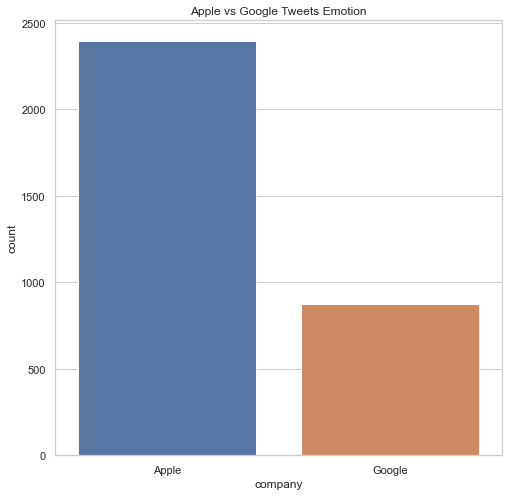
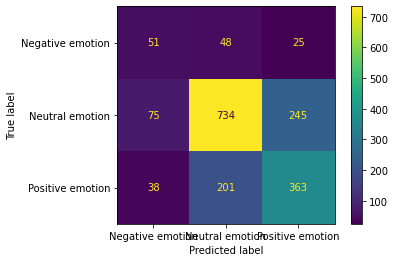
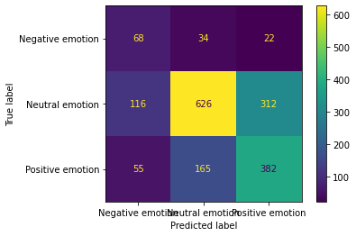
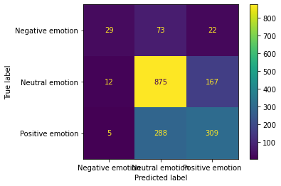
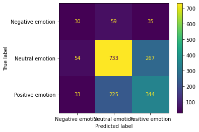
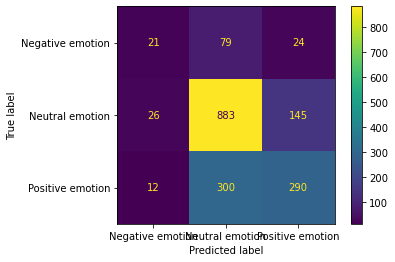
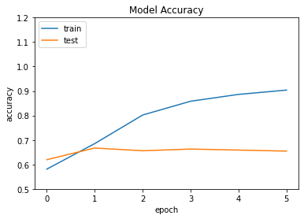
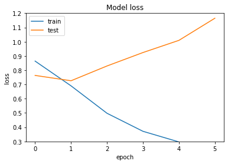

# Twitter Sentiment Analysis with Natural Language Processing

## Overview

In a day, there are over 500 million tweets among all the twitter followers. That's 6,000 tweets every second and it could be about a person, place, or thing. In this case, it is all about Apple and Google products. Apple has more than 13 million Twitter followers and Google has more than 22 million Twitter followers. The goal of this project is to build a model that can classify the sentiment of a tweet based on its contents. 

## Business Understanding

Twitter is one of the biggest social platforms. Unlike its competitors facebook and instagram, the 'posts' on Twitter are small messages, referred to as 'Tweets'. These Tweets can be categorized under hashtag or keywords that relate to a certain topic. Therefore, modelling can extract positive, negative or neutral sentiment from Tweets that has various advantages for business.   This project is to perform supervised sentiment analysis on Twitter tweets about Google and Apple products using Natural Language Processing(NLP) model, so the model can rate the sentiment of a Tweet based on its content.

## Data 

Obtained the dataset from CrowdFlower
Source: https://www.crowdflower.com/data-for-everyone/
This dataset has tweets of human raters rated the sentiment in over 9000 Tweets. It has 3 columns

- tweet_text: Tweet text and user name
- emotion_in_tweet_is_directed_at: Name of the brand or service
- is_there_an_emotion_directed_at_a_brand_or_product: Emotion i.e.Negative,Positive, Neutral

Renamed the column names with 'tweet_text', 'tweet_product', and 'emotion' since they were really long names. This is a multiclass problem, where sentiments are either negative, positive, or neutral. The data presented a challenge in terms of class imbalance; the majority of the data was labeled as 'neutral', leaving a relatively small amount of samples that indicated actual sentiment, positive or negative.

## Methodology

A variety of pre-processing and modeling techniques were explored in order to effectively transform the text data and build a strong classifier. Model performance was evaluated on recall scores to predict the correct number of positive tweets. 

Preprocessing includes,

- Data cleaning and exploration to sort into relevant categories
- Tokenization of words and removal of stop words
- Vectorization of text data using TF-IDF(Term Frequency Inverse Document Frequency)

Apple has more tweets than Google

## Modelling

Model types explored were,

- Logisitc Regression
- Naive Bayes Classifer
- Random Forest Classifier
- Decision Tree Classifier
- XGBoost Classifier

After the cross validation and oversampling techniques there is an improvement in positive and negative tweets. Train accuracy is 83% and test accuracy is 65%. still the data is overfit.

Both the training and testing models did not score well. This was because the training model overfit to the neutral tweets. This greatly lowered the models predicting power in pulling out the positive and negative tweets.

In the Random Forest model, there was a little improvement of predicting positive and negative tweets.

There was no improvement after cross validation and over sampling techniques. The f1 score also remains the same. 

In XGBoost classifier, the train accuracy is 81% and test accurcy is 67%. There was no big improvement after cross validation and over sampling techniques. 

## Deep Neural Network

Building a sequential model, starting with an embedding layer of 20,000 words, which is the number of words in the tokenizer and setting the embedding size as 128. Adding two layers, an LSTM and dense layers.find the model accuracy and loss function.

Neural network achieved 93% accuracy on the training set and the loss function is 0.35. Accuracy of test set is 64% and the loss function is 2.85.

## Conclusion and Next Step

- These models show some success in predicting Twitter sentiment. I would recommend the Random Forest Classification model. This model was relatively successful in extracting both negative and positive tweet sentiments, and is conservative in how many inaccuracies it is making compared to the rest of the models. 
- The data seems to be heavily grounded in tech, with the number one key word being a hashtag for a tech confrence. Furthermore, iPad, Google, Apple, and iPhone are extremely prevalent key words. I believe this model is possibly associating certain tech words or brands with positive or negative sentiment. The process must be repeated with a larger data set that has a diverse field of interest.
- Adding more data could also allow the use of a simpler neural net model, which could help to reduce runtimes.
- Further tuning of models using grid search. This would have allowed all the models to be tuned to the precise settings that would yield the good results.

## Repository Directory

├── data             <-- Data in CSV format
│
├── images           <-- model visualization
│   
│
├── jupyter notebook        <-- Jupyter Notebooks for exploration and report
│   
├── presentation     <-- Non technical presentation
│
└── README.md        <-- Main README file explaining the project's business case,
│                        methodology, and findings